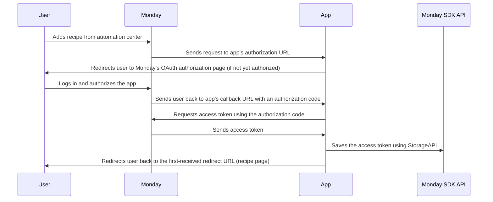
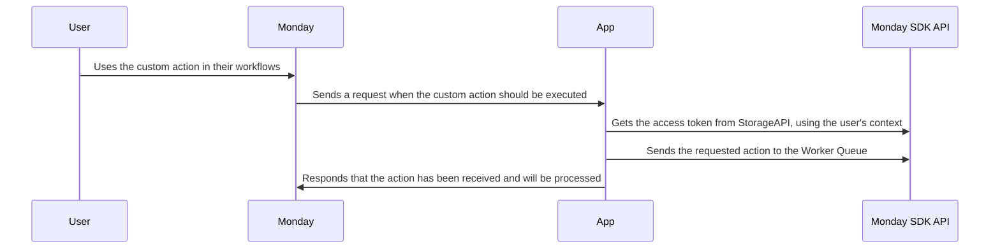
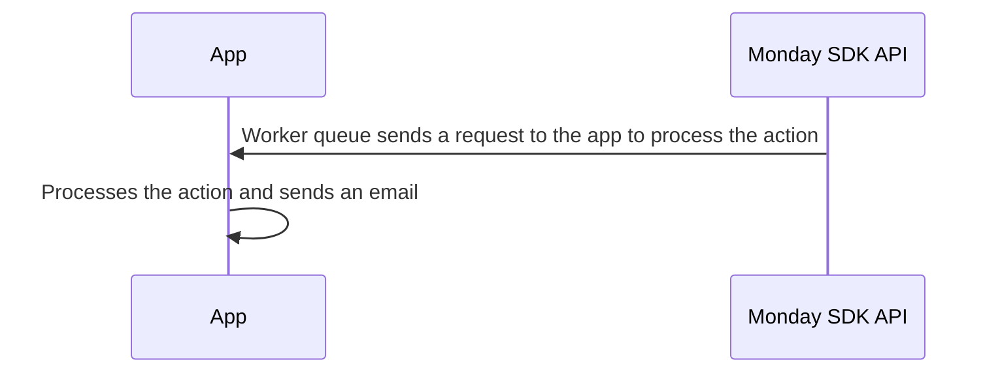

# Monday-Code NodeJS Quickstart

This Node - express with typescript application is designed to showcase the practical use of monday code and monday api
sdk by integrating various monday app functionalities. It's an essential resource for developers looking to leverage
Monday Code and Monday API features through NodeJS environment.

## Getting Started

These instructions will get you a copy of the project up and running on your local machine for development and testing
purposes.

### Prerequisites

You need to have NodeJS and npm installed on your machine.
You can download NodeJS from [here](https://nodejs.org/en/download/package-manager) and it should install npm as well.

### Installing

To install the project, follow these steps:

1. Clone the repository
2. Navigate to the project directory
3. Install the required packages using npm:

```bash
cd quickstart-node
npm i
```

## Compiling Files

If you want to compile the ts files to js files you can use the following command in the project directory:

```bash
npm run build
```

## Running the Application

To run the application in development mode, use the following command in the project directory:

```bash
npm run dev
```

You can also start the application for production after you compiled the ts files using this command:

```bash
npm run start
```

If you did not set a port environment variable, the application will start running at `http://0.0.0.0:3000`.

## Features

This app showcases how to use various Monday app functionalities, including:

### Monday Code Features

* Using Monday apps Storage and Secure Storage
* Using Monday apps Secrets and Environment variables
* Using Monday apps Queue
* Using Monday code Logger

**NOTE**: Storage feature does not work locally, you can only check it after you push your code to Monday Code

### Monday API Usage

* An example of updating column value in an item
* An example of a custom query with generated types
* An example of error handling with the Monday API

### Integration and Authentication

* Implementing OAuth process
* Authenticating with JWT (JSON Web Tokens)

### Custom Actions and Triggers in Monday

* Creating custom actions and triggers
* Implementing an integration recipe
* Deploying the app to Monday code

### Error Handling

* Example of global error handler middleware
* Example of Monday API error handling middleware

If you want to learn more about how to send appropriate error messages from your app to monday automations
click [here](https://developer.monday.com/apps/docs/error-handling).

## Setting up the app in Monday

Follow the instructions listed in the [SETUP.md](SETUP.md) file

## Flow and Usage

### NOTE:

    This project is only a demonstration of how to use various Monday Code app and Monday API functionalities.
    It is not intended for production use without further modifications.
    Please ensure to review and update the code as necessary to fit your specific needs and requirements
    Remember to keep your OAuth credentials secure and do not expose them in your code or version control system. Use environment variables or other secure methods to handle sensitive data.

### Sequence Diagram

### Authorization



1. A user adds your recipe from the automation center.
2. Monday sends a request to your app's authorization URL as configured in `Feature Details`.
3. If the user has not yet authorized the app, the app redirects the user to Monday's OAuth authorization page.
4. The user logs in and authorizes the app.
5. Monday sends a request to the app's callback URL with an authorization code.
6. The app exchanges with Monday the authorization code for an access token, This token is then used for subsequent
   requests to the server.
7. The app saves the access token using Monday's StorageAPI.
8. The app redirects the user back to the first-received redirect URL, in this case, the recipe page.

### Custom Action



8. The user can now use the custom action in their workflows.
9. The app receives a request from Monday when the custom action should be executed.
10. The apps gets the access token from Monday Code StorageAPI, using the user's context.
11. The apps sends the requested action to Monday Code Worker Queue, to be executed asynchronously.
12. The app sends a response to Monday, indicating that the action has been received and will be processed.

### Worker Queue



13. The worker queue sends a request to the app to process the action.
14. The app processes the action and sends an email.
