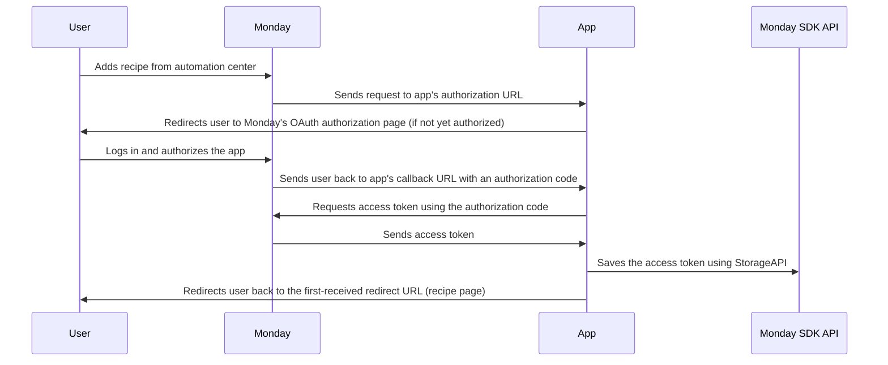
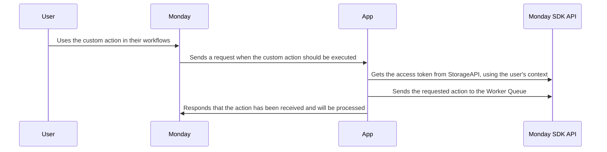
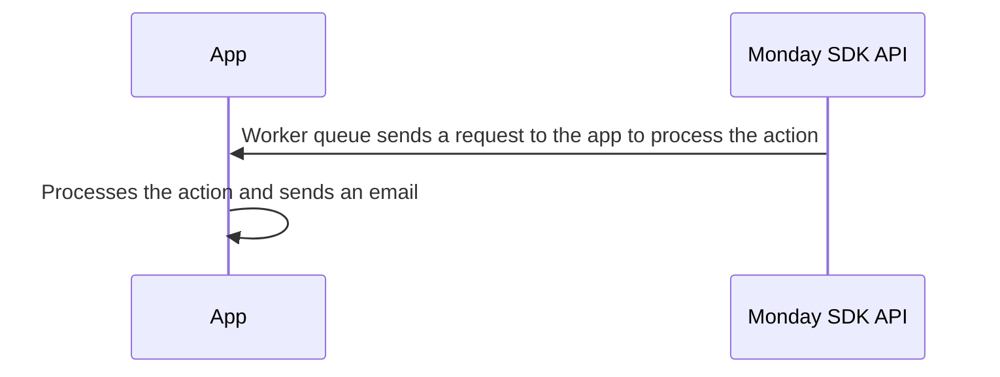

# Monday-Code Python Quickstart

This Python Flask application is designed to showcase the practical use of the monday code platform by integrating various monday app functionalities.
It's an essential resource for developers looking to leverage Monday Code features through a Python environment.

## Getting Started

These instructions will get you a copy of the project up and running on your local machine for development and testing purposes.

### Prerequisites

You need to have Python and pip installed on your machine.
You can download Python from [here](https://www.python.org/downloads/) and pip is included in Python 3.4 and later versions.

You can use [venv](https://packaging.python.org/en/latest/guides/installing-using-pip-and-virtual-environments/) to create a virtual environment and install the required packages.

### Installing

To install the project, follow these steps:

1. Clone the repository
2. Navigate to the project directory
3. Install the required packages using pip:

```bash
pip install -r requirements.txt
```

## Running the Application

To run the application, use the following command in the project directory:

```bash
python main.py
```

The application will start running at `http://0.0.0.0:8080`.

## Features

This app showcases how to use various Monday app functionalities, including:

* Using Monday apps storage
* Utilizing Monday apps Secrets / Environment variables
* Using Monday apps Queue
* Implementing OAuth process
* Authenticating with JWT (JSON Web Tokens)
* Creating custom actions and triggers
* Implementing an integration recipe
* Deploying the app to Monday code

## Setting up the app in Monday

Follow the instructions listed in the [SETUP.md](SETUP.md) file

## Flow and Usage

### NOTE:

    This project is only a demonstration of how to use various Monday Code app functionalities.
    It is not intended for production use without further modifications.
    Please ensure to review and update the code as necessary to fit your specific needs and requirements
    Remember to keep your OAuth credentials secure and do not expose them in your code or version control system. Use environment variables or other secure methods to handle sensitive data.

### Sequence Diagram


### Authorization



1. A user adds your recipe from the automation center.
2. Monday sends a request to your app's authorization URL as configured in `Feature Details`.
3. If the user has not yet authorized the app, the app redirects the user to Monday's OAuth authorization page.
4. The user logs in and authorizes the app.
5. Monday sends a request to the app's callback URL with an authorization code.
6. The app exchanges with Monday the authorization code for an access token, This token is then used for subsequent requests to the server.
7. The app saves the access token using Monday's StorageAPI.
8. The app redirects the user back to the first-received redirect URL, in this case, the recipe page.

### Custom Action



8. The user can now use the custom action in their workflows.
9. The app receives a request from Monday when the custom action should be executed.
10. The apps gets the access token from Monday Code StorageAPI, using the user's context.
11. The apps sends the requested action to Monday Code Worker Queue, to be executed asynchronously.
12. The app sends a response to Monday, indicating that the action has been received and will be processed.

### Worker Queue



13. The worker queue sends a request to the app to process the action.
14. The app processes the action and sends an email.
